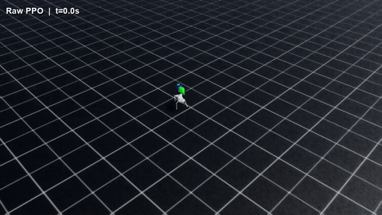
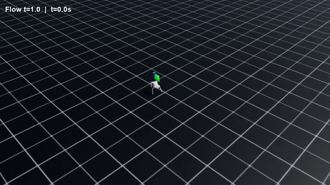
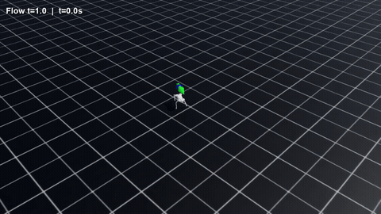
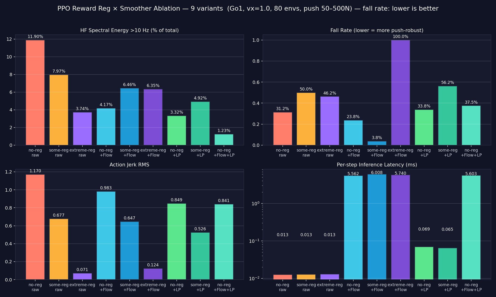

# Exploring Jitter-Reduction Methods for RL Locomotion Policies

<p align="center">
  <em>A systematic ablation across reward regularisation, online filtering, and flow-matched
  action refinement, applied to a Unitree Go1 in NVIDIA Isaac Sim — nine variants compared
  head-to-head under push-recovery stress tests.</em>
</p>

<p align="center">
  <b><a href="https://mercurialkraken.github.io/16299-final-project-quadruped-regularisation/">📄 Read the full interactive report →</a></b>
</p>

<p align="center">
  <b>16-299 · Robotics · Spring 2026 · Carnegie Mellon University</b><br/>
  Paul Colombo · Arnav Shah · Jack Gerdsen<br/>
  Robot: Unitree Go1 &nbsp;·&nbsp; Simulator: NVIDIA Isaac Sim 5.1
</p>

---

## TL;DR

RL policies make quadrupeds walk, but the actions they output are **jittery** — the motors
twitch at high frequency between control steps, which fluctuates ground forces, hurts balance,
and wears out hardware. Given a working-but-jittery PPO policy, what is the best way to reduce
its jitter *without* making it worse at the actual task?

We compare three interventions at different stages of the policy lifecycle — reward-side action
regularisation (training), online causal low-pass filtering (deployment), and a learned
flow-matching action refinement (post-hoc) — and cross them into a **9-variant ablation**.

**Headline:** the winning configuration (mild reward regularisation + a flow trained on
physics-aware, low-passed "optimal" targets) cuts the push-recovery **fall rate from 50.00% →
3.75% (−46.25 pp)** and **HF spectral energy by ~19%**, adding only ~6 ms of inference per
20 ms control step.

---

## Push-recovery videos

Same Unitree Go1 policy (`some-reg`, the Isaac Lab default `λ_action_rate = −0.01`), same
80-environment push test (50–500 N lateral impulses), three different post-hoc smoothing
treatments. These are the clips shown on the [project site](https://mercurialkraken.github.io/16299-final-project-quadruped-regularisation/#results).

<table>
  <tr>
    <td align="center" width="50%"><b>Some-reg PPO · raw</b><br/><code>50.00% falls</code></td>
    <td align="center" width="50%"><b>Some-reg + Bal-LP Flow</b><br/><code>3.75% falls</code> 🏆</td>
  </tr>
  <tr>
    <td>
      <a href="assets/push_video_raw.mp4"></a>
    </td>
    <td>
      <a href="assets/push_video_ballp.mp4"></a>
    </td>
  </tr>
</table>

The same policy, smoothed with a **plain causal low-pass filter** instead of the flow, is
included for contrast (`assets/push_video_lp.mp4`). The task-blind filter blunts the sharp
corrective hip-flicks needed to catch a push, so it actually falls *more* than the raw policy:

<table>
  <tr>
    <td align="center" width="50%"><b>Some-reg + Causal IIR LP</b><br/><code>56.25% falls</code> ❌</td>
  </tr>
  <tr>
    <td>
      <a href="assets/push_video_lp.mp4"></a>
    </td>
  </tr>
</table>

> [!NOTE]
> The previews above are looping GIFs, which animate inline on GitHub. Click any preview to
> open the full-quality `.mp4` in [`assets/`](assets).

| Asset | Variant | Fall rate |
|---|---|---|
| `assets/push_video_raw.mp4` | Some-reg PPO, raw (no smoothing) | 50.00% |
| `assets/push_video_ballp.mp4` | Some-reg + Bal-LP Flow (**winner**) | **3.75%** |
| `assets/push_video_lp.mp4` | Some-reg + Causal IIR low-pass | 56.25% |

---

## Results



*Lower is better on all panels. Some-reg + Bal-LP Flow achieves the lowest fall rate by a wide
margin; extreme-reg + Flow collapses to 100% falls.*

| Variant | `λ_action_rate` | HF >10 Hz | a-rate RMS | Fall rate | Inf. (ms) |
|---|---|---|---|---|---|
| 🥇 Some-reg + Flow | −0.01 | 6.46% | 0.723 | **3.75%** | 6.0 |
| No-reg + Flow | 0 | 4.17% | 0.970 | 23.75% | 5.6 |
| No-reg PPO (raw) | 0 | 11.90% | 1.010 | 31.25% | 0.013 |
| No-reg + LP | 0 | 3.32% | 0.888 | 33.75% | 0.069 |
| No-reg + Flow + LP | 0 | **1.23%** | 0.915 | 37.50% | 5.6 |
| Extreme-reg PPO (raw) | −0.5 | 3.74% | 0.049 | 46.25% | 0.013 |
| Some-reg PPO (raw) | −0.01 | 7.97% | 0.717 | 50.00% | 0.013 |
| Some-reg + LP | −0.01 | 4.92% | 0.671 | 56.25% | 0.065 |
| ❌ Extreme-reg + Flow | −0.5 | 6.35% | 0.077 | **100.00%** | 5.7 |

The reward action-rate penalty has a **sharp sweet spot at −0.01**: removing it weakens the
flow's benefit, while pushing it to −0.5 breaks the underlying policy so badly (the robot barely
walks) that the flow makes things worse.

---

## Repository layout

```
.
├── index.html                 # The full report / project website (GitHub Pages source)
├── assets/                    # Figures + push-recovery videos used by index.html
│   ├── ablation_comparison.png
│   ├── flow_matching_paths_intuition.png
│   ├── push_video_raw.mp4     # some-reg, raw
│   ├── push_video_ballp.mp4   # some-reg + Bal-LP flow (winner)
│   └── push_video_lp.mp4      # some-reg + causal IIR low-pass
└── src/                       # → git submodule: github.com/PaulCarnegie10/quadruped-flow-matching
    ├── README.md              # Code-repo overview + pipeline at a glance
    ├── code/                  # training / evaluation / analysis / visualization / utilities
    ├── configs/               # RSL-RL / Isaac Lab YAML configs (flat + rough)
    ├── data/                  # JSON extracts from training & eval runs
    └── docs/
        └── PROJECT_KNOWLEDGE_BASE.md   # Full write-up: math, decisions, results
```

`src/` is a **git submodule** pointing at the canonical code repo
[`PaulCarnegie10/quadruped-flow-matching`](https://github.com/PaulCarnegie10/quadruped-flow-matching).
Clone this repo with `git clone --recurse-submodules …`, or in an existing clone run
`git submodule update --init` to populate it.

The live site is published from `index.html` at
**https://mercurialkraken.github.io/16299-final-project-quadruped-regularisation/**.

## Method in one paragraph

We train three PPO policies on the Go1 (200 Hz physics, 50 Hz control) that differ *only* in the
reward action-rate weight `λ ∈ {0, −0.01, −0.5}`. For each, we roll out the frozen policy, and at
every visited state run short-horizon random shooting (`K=16` candidates, `H=10` steps) scored by
a physics-aware cost (tracking + jerk + energy + stability) to produce "better" target actions
`a*`. We low-pass-filter those target trajectories (2nd-order Butterworth, 15 Hz, zero-phase) —
the **Bal-LP** recipe — then train a small conditional flow-matching velocity network to transport
raw PPO actions toward them, integrated with 20 Euler steps at deployment (~6 ms). Full derivation
and reproduction steps are in [`src/docs/PROJECT_KNOWLEDGE_BASE.md`](src/docs/PROJECT_KNOWLEDGE_BASE.md).

## Reproducing

The code lives in the `src/` submodule (canonical repo:
[`PaulCarnegie10/quadruped-flow-matching`](https://github.com/PaulCarnegie10/quadruped-flow-matching)).
Prerequisites, exact commands, and hyperparameters are documented in
[`src/README.md`](src/README.md) and [`src/docs/PROJECT_KNOWLEDGE_BASE.md`](src/docs/PROJECT_KNOWLEDGE_BASE.md).
Runs target NVIDIA Isaac Sim 5.1 + Isaac Lab. If you cloned without submodules, run
`git submodule update --init` first.

## Authors

Paul Colombo · Arnav Shah · Jack Gerdsen — 16-299, Carnegie Mellon University, Spring 2026.

## References

Key references (full list in the [report](https://mercurialkraken.github.io/16299-final-project-quadruped-regularisation/#references)):

- Lipman et al. (2023), *Flow Matching for Generative Modeling*, ICLR (arXiv:2210.02747).
- Schulman et al. (2017), *Proximal Policy Optimization Algorithms* (arXiv:1707.06347).
- Mittal et al. (2023), *Orbit / Isaac Lab*, IEEE RA-L.
- Rudin et al. (2022), *Learning to Walk in Minutes Using Massively Parallel Deep RL*, CoRL.
